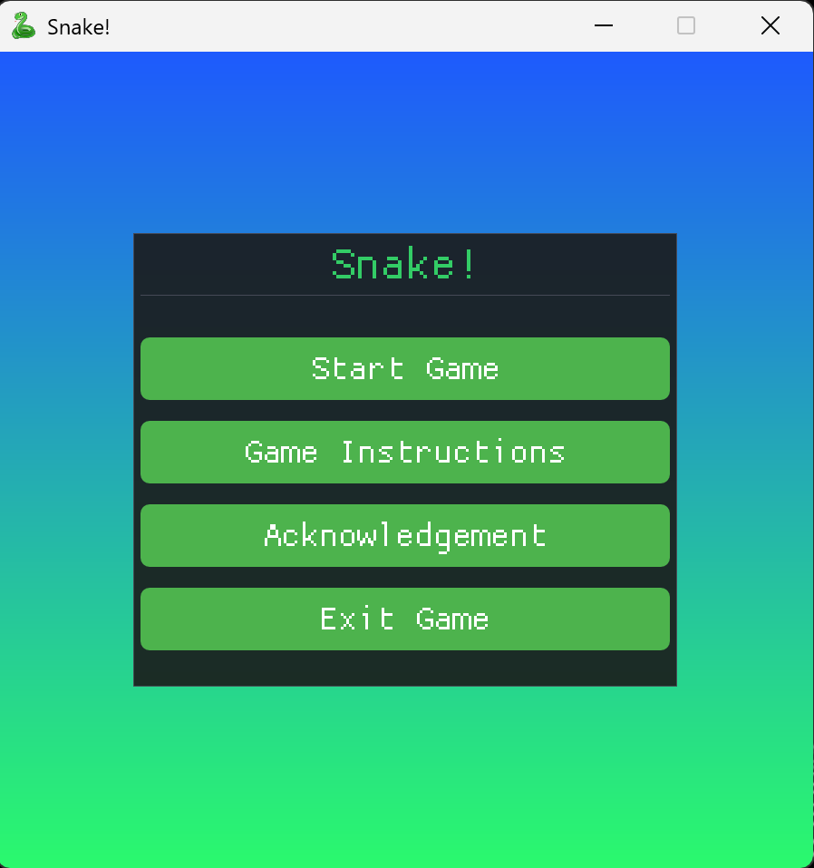

# Snake Game

### Overview

A snake game developed in C++ using Visual Studio 2022  
<strong>External library used</strong>: [Raylib](https://www.raylib.com/), 
[Dear ImGui](https://github.com/ocornut/imgui), 
[rlImGui](https://github.com/raylib-extras/rlImGui)

### Features

- <strong>Dual difficulty modes. In Hard mode random obstacles are generated and the snake speeds up as it grows</strong>
- <strong>High-impact explosion effects and screen shake upon collision</strong>
- <strong>Built-in 6 background tracks, supports:  
  - Space: Pause / Resume  
  - A / D: Previous / Next track  
  - W / S: Volume adjustment (±10%) with normalized initial levels  
    (Notice: I've already adjusted the initial volume accroding to the source file)</strong>
- <strong>Highest scores for both modes are automatically saved to a local folder</strong>  

### Screenshots

 

  
   
  <em><strong>Menu</strong></em>
    
  
   
  <em><strong>Normal mode</strong></em>
    
  
   
  <em><strong>Hard mode</strong></em>

#### Give it a try now! 👉: [Download](https://github.com/LCZ-ctrl/Snake_Game/releases)
  
#### How to install external libraries
- raylib and imgui: [vcpkg](https://www.youtube.com/watch?v=UiZGTIYld1M)
- rlimgui:  
  - Make sure you have installed imgui first
  - Clone the library: [rlImGui](https://github.com/raylib-extras/rlImGui), move the entire folder under the project folder
  - In Visual Studio, right-click the project, select "Properties", select "C/C++", select "General", and add the folder in "Additional Include Directories"
